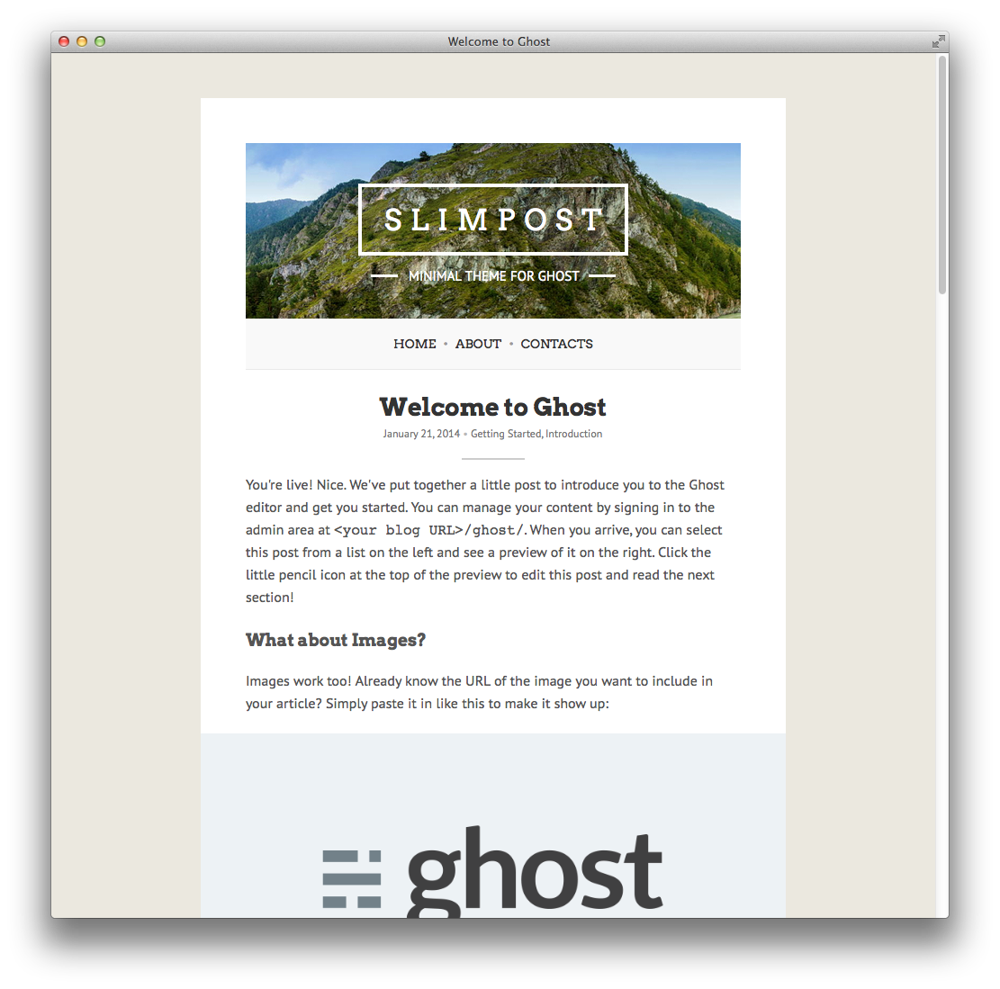

##Slimpost — Minimal theme for Ghost

###Overview
**Slimpost** is clean, minimal and responsive theme for Ghost.

**Demo**: [http://themes.infinitum.me/slimpost](http://themes.infinitum.me/slimpost)  
**Topic in Ghost Forum**: [https://ghost.org/forum/themes/1675-clean-and-simple-theme-slimpost](https://ghost.org/forum/themes/1675-clean-and-simple-theme-slimpost)

####Features
- Clean and minimal design
- Responsive HTML5/CSS3 layout with Rich Snippets
- OpenGraph and Twitter Cards
- Static pages
- Disqus integration
- Social links
- Fullscreen image viewer
- Syntax Highlight
- Custom fonts

###Installation
1. Extract content of ZIP archive from GitHub into theme directory: <code>/content/themes/slimpost</code>.
2. Restart **Ghost** instance.
3. Sign in to **Ghost Admin**, then go to **Settings → General** and select **slimpost** in themes list.

###Configuration

####Social links
Set up links to your social profiles in <code>partials/social-links.hbs</code>.
You can add another social icons if you want because Cameraman uses Font Awesome Icons. You can check out all social icons [here](http://fontawesome.io/icons/#brand "Font Awesome Icons").

####Disqus comments
If you would like to use Disqus comments just change your shortname in <code>partials/comments.hbs</code>:
<pre><code>{{! Disqus shortname }}
var disqus_shortname = 'example';</code></pre>

####Static pages menu
Ghost Aton (0.4) bring to us static pages feature. So if you want to add links of static pages in menu, you need to modify <code>partials/navigation.hbs</code>.

####Twitter Cards
Set up your Twitter profile in <code>default.hbs</code>:
<pre><code>&lt;meta name="twitter:site" content="@username"&gt;
&lt;meta name="twitter:creator" content="@username"&gt;</code></pre>

###Theme preview

